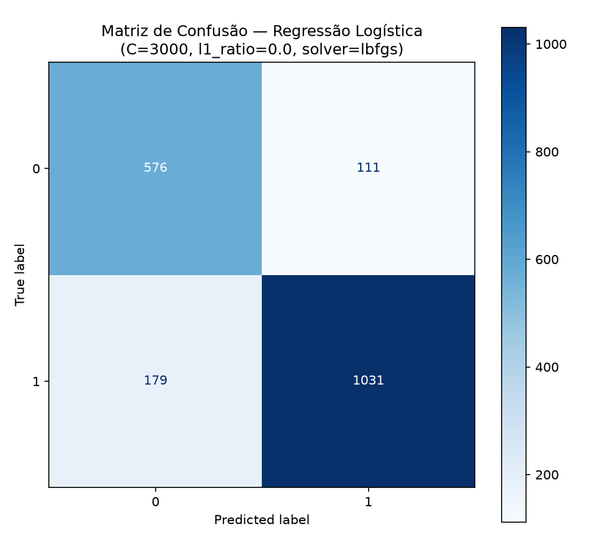

# Relatório de Resultados — Regressão Logística

## 1. Configuração do Modelo

O modelo empregado neste estudo foi a **Regressão Logística** (`LogisticRegression`, scikit-learn), cujos hiperparâmetros foram determinados por meio de um processo de **Grid Search**. A tabela a seguir apresenta a configuração final selecionada:

| Hiperparâmetro     | Valor       |
| ------------------- | ----------- |
| `C`                  | **3000**    |
| `l1_ratio`           | **0.0** (equivalente à penalidade L2 pura) |
| `class_weight`       | **None**    |
| `solver`             | **lbfgs**   |
| `max_iter`           | **2000**    |
| `random_state`       | **42**      |

O parâmetro `C` controla o inverso da força de regularização do modelo (`C = 1/λ`): valores altos de `C`, como o `3000` selecionado, representam penalização praticamente inexistente sobre a magnitude dos coeficientes, dando ao modelo grande liberdade para ajustar seus pesos aos dados de treino.

> **Observação:** este relatório não inclui uma tabela de métricas médias de validação cruzada (accuracy, precision macro, recall macro, F1 macro do Grid Search), pois esses valores agregados não estavam disponíveis no momento da elaboração — apenas os hiperparâmetros finais selecionados. Caso o log completo do Grid Search seja recuperado, esta seção deve ser complementada.

---

## 2. Pré-processamento: Efeito do Log-Transform

Diferentemente de modelos baseados em árvore de decisão (como o Random Forest), a Regressão Logística é um **modelo linear**: sua saída bruta é uma combinação linear das features (ver Seção 9, "O que é `z`"), o que a torna sensível não apenas à escala, mas também à **forma da distribuição** de cada feature.

Na primeira rodada de treino, identificou-se que duas features — `planet_radius_earth` e `insolation_flux_earth` — apresentavam distribuição de cauda longa extrema (coeficiente de assimetria, ou *skew*, de 53,13 e 50,80, respectivamente — muito acima do limiar de referência de 1,0 que já indica assimetria relevante). Isso fazia com que o modelo atribuísse coeficientes desproporcionalmente altos a essas duas features para acomodar poucos casos-outlier, produzindo uma saída linear (`z`) que chegava a **2667,31** no conjunto de teste — um valor muito além do necessário para saturar a função sigmoide (que já satura para |z| acima de ~10).

Aplicou-se a transformação `log1p` (log(1+x)) a quatro features com maior assimetria — `orbital_period_days`, `transit_depth_ppm`, `planet_radius_earth` e `insolation_flux_earth` — antes da padronização com `StandardScaler`. O efeito sobre a assimetria dessas features foi:

| Feature | Skew antes | Skew depois |
|---|---:|---:|
| `orbital_period_days` | 3,47 | 0,61 |
| `transit_depth_ppm` | 5,37 | 1,20 |
| `planet_radius_earth` | 53,13 | 1,48 |
| `insolation_flux_earth` | 50,80 | 0,19 |

O impacto dessa mudança sobre o modelo final foi substancial:

| Indicador | Antes do log-transform | Depois do log-transform |
|---|---:|---:|
| Intercept | 11,503 | **3,083** |
| Maior coeficiente (feature) | 171,41 (`planet_radius_earth`) | **9,25** (`planet_radius_earth`) |
| z mínimo (teste) | -3,123 | -5,347 |
| z máximo (teste) | **2667,307** | **49,909** |
| z médio (teste) | 7,640 | 3,008 |
| Accuracy (teste) | 0,8555 | 0,8471 |

O maior coeficiente do modelo caiu de 171,41 para 9,25 — passando a ficar na mesma ordem de grandeza das demais 11 features (que variam entre aproximadamente 0,3 e 9,3 em módulo). O `z` máximo no conjunto de teste caiu de 2667 para cerca de 50, uma redução de mais de 50 vezes. A acurácia teve uma queda pequena, de menos de 1 ponto percentual, o que é consistente com o esperado: o modelo deixou de depender de poucos outliers extremos para "acertar com confiança exagerada" alguns casos, passando a fazer previsões com magnitude de confiança mais realista, sem perda relevante de poder preditivo. Os coeficientes finais, na ordem das 12 features, foram:

| Feature | Coeficiente |
|---|---:|
| `orbital_period_days` | 3,904 |
| `transit_duration_hours` | 0,659 |
| `transit_depth_ppm` | -6,142 |
| `planet_radius_earth` | 9,251 |
| `insolation_flux_earth` | 2,598 |
| `equilibrium_temperature_k` | 3,134 |
| `impact_parameter` | -1,491 |
| `transit_signal_to_noise` | 0,542 |
| `stellar_effective_temperature_k` | -0,988 |
| `stellar_surface_gravity` | 4,784 |
| `stellar_radius_solar` | 2,214 |
| `kepler_magnitude` | 0,333 |

---

## 3. Avaliação no Conjunto de Teste

O modelo final foi treinado com o conjunto de treinamento completo (5.689 amostras) e avaliado sobre o conjunto de teste, composto por **1.897 amostras**, distribuídas da seguinte forma:

| Classe    |  Amostras |
| ---------- | --------: |
| Classe 0   |       687 |
| Classe 1   |     1.210 |
| **Total**  | **1.897** |

Os resultados obtidos no conjunto de teste foram:

| Classe            | Precision |   Recall | F1-score |   Support |
| ------------------ | --------: | -------: | -------: | --------: |
| **0**               |      0,76 |     0,84 |     0,80 |       687 |
| **1**               |      0,90 |     0,85 |     0,88 |     1.210 |
| **Macro avg**       |  **0,83** | **0,85** | **0,84** |     1.897 |
| **Weighted avg**    |  **0,85** | **0,85** | **0,85** |     1.897 |
| **Accuracy**        |           |          | **0,85** | **1.897** |

A acurácia final obtida foi de **0,8471**, correspondendo a aproximadamente **84,71%** de classificações corretas.

---

## 4. Matriz de Confusão

A matriz de confusão permite analisar diretamente os acertos e os erros cometidos pelo modelo em cada classe. A partir dela derivam-se os quatro valores usados nas fórmulas das métricas apresentadas nas seções seguintes:

- **VP (Verdadeiro Positivo):** amostras da classe positiva corretamente classificadas;
- **VN (Verdadeiro Negativo):** amostras da classe negativa corretamente classificadas;
- **FP (Falso Positivo):** amostras da classe negativa classificadas incorretamente como positivas;
- **FN (Falso Negativo):** amostras da classe positiva classificadas incorretamente como negativas.

/home/lucaslima/Área de trabalho/Projetos/ml_exoplanets_tg/ml_exoplanets/ml_core/Logistic Regression/matriz_confusao.png

**Figura 1** — Matriz de confusão do modelo de Regressão Logística no conjunto de teste (dados com log-transform).

A matriz obtida foi:

|              | Predito: 0 | Predito: 1 |
| ------------- | ---------: | ---------: |
| **Real: 0**    |    **576** |    **111** |
| **Real: 1**    |    **179** |  **1.031** |

A interpretação dos valores é a seguinte:

- **576** amostras da classe 0 foram corretamente classificadas como classe 0;
- **111** amostras da classe 0 foram incorretamente classificadas como classe 1;
- **179** amostras da classe 1 foram incorretamente classificadas como classe 0;
- **1.031** amostras da classe 1 foram corretamente classificadas como classe 1.

O modelo classificou corretamente **1.607** amostras de um total de **1.897**, resultando em uma acurácia de **84,71%**.

O total de erros foi de **290 amostras**, correspondendo a aproximadamente **15,29%** do conjunto de teste. Diferentemente do Random Forest, aqui os erros não são tão equilibrados entre as classes:

| Tipo de Erro          | Quantidade |
| ---------------------- | ---------: |
| Classe 0 → Classe 1     |    **111** |
| Classe 1 → Classe 0     |    **179** |

O modelo erra quase 60% mais ao classificar amostras da classe 1 como classe 0 do que o contrário — um indicativo de que a fronteira de decisão linear tem mais dificuldade em capturar certos casos da classe majoritária do que a fronteira, mais flexível, do Random Forest.

---

## 5. Precision

A *precision* indica, entre as amostras classificadas pelo modelo como pertencentes a uma determinada classe, quantas de fato pertenciam a essa classe. É calculada, para cada classe, por:

$$Precision = \frac{VP}{VP + FP}$$

Já a *precision macro*, que resume o desempenho do modelo entre as $C$ classes com peso igual para cada uma, é dada pela média aritmética simples das precisions individuais:

$$Precision_{macro} = \frac{1}{C}\sum_{i=1}^{C} Precision_i$$

Os resultados obtidos foram:

| Classe               |  Precision |
| --------------------- | ---------: |
| Classe 0               |   **0,76** |
| Classe 1               |   **0,90** |
| **Precision macro**    | **≈ 0,83** |

A precision da classe 1 é bem mais alta que a da classe 0 (0,90 contra 0,76): quando o modelo prevê que um objeto é `FALSE POSITIVE` (classe 1), ele acerta com mais frequência do que quando prevê `CONFIRMED` (classe 0). Isso indica um desempenho menos equilibrado entre as classes do que o observado no Random Forest.

---

## 6. Recall

O *recall* mede a capacidade do modelo de identificar corretamente as amostras que de fato pertencem a uma determinada classe. É calculado, para cada classe, por:

$$Recall = \frac{VP}{VP + FN}$$

Da mesma forma, o *recall macro* é a média aritmética simples dos recalls individuais das $C$ classes:

$$Recall_{macro} = \frac{1}{C}\sum_{i=1}^{C} Recall_i$$

Os resultados obtidos foram:

| Classe             |     Recall |
| ------------------- | ---------: |
| Classe 0             |   **0,84** |
| Classe 1             |   **0,85** |
| **Recall macro**     | **≈ 0,85** |

Os valores de recall entre as duas classes são bastante próximos (0,84 e 0,85), o que indica que o modelo não deixa de identificar amostras de nenhuma das classes de forma desproporcional — a maior diferença de desempenho está concentrada na *precision*, não no *recall*.

---

## 7. F1-score

O **F1-score** combina *precision* e *recall* em uma única métrica, por meio da média harmônica entre os dois, sendo particularmente útil quando há interesse em equilibrar ambos os aspectos de desempenho:

$$F1 = 2 \times \frac{Precision \times Recall}{Precision + Recall}$$

O **F1 macro** é obtido calculando o F1-score de cada classe individualmente e, em seguida, tirando a média aritmética simples entre as $C$ classes:

$$F1_{macro} = \frac{1}{C}\sum_{i=1}^{C} F1_i$$

Os resultados obtidos foram:

| Classe         |   F1-score |
| --------------- | ---------: |
| Classe 0         |   **0,80** |
| Classe 1         |   **0,88** |
| **F1 macro**     | **≈ 0,84** |

O F1-score de 0,80 para a classe 0 e 0,88 para a classe 1 confirmam a assimetria de desempenho entre as classes já observada na precision — a classe 0 (`CONFIRMED`) é consideravelmente mais difícil para o modelo linear do que a classe 1 (`FALSE POSITIVE`).

---

## 8. Accuracy

A *accuracy* (acurácia) representa a proporção de previsões corretas — considerando todas as classes conjuntamente — em relação ao total de amostras avaliadas:

$$Accuracy = \frac{VP + VN}{VP + VN + FP + FN}$$

A acurácia obtida no conjunto de teste foi:

**Accuracy = 0,8471**

Ou seja, aproximadamente **84,71%** das amostras foram classificadas corretamente. Como o conjunto de dados apresenta distribuição desigual entre as classes (36,22% para classe 0 e 63,78% para classe 1), a acurácia isolada tende a favorecer visualmente o desempenho da classe majoritária, reforçando a importância de olhar também para o F1 macro e as métricas por classe apresentadas nas seções anteriores.

---

## 9. Interpretação de `z` e da Função Sigmoide

Antes de a Regressão Logística converter sua saída em uma probabilidade, ela calcula a combinação linear:

$$z = \beta_0 + \beta_1x_1 + \beta_2x_2 + ... + \beta_{12}x_{12}$$

onde `β₀` é o intercepto e cada `βᵢ` é o coeficiente aprendido para a feature `xᵢ`. Esse `z` (retornado por `decision_function()` no scikit-learn) pode assumir qualquer valor real, positivo ou negativo. É a função sigmoide, `σ(z) = 1 / (1 + e⁻ᶻ)`, que o converte para o intervalo entre 0 e 1 (a probabilidade prevista).

A sigmoide já satura — fica achatada em 0 ou 1, sem distinção prática de confiança — para `|z|` acima de aproximadamente 10. Com os dados originais (sem log-transform), o `z` do conjunto de teste chegava a **2667,31**, um valor centenas de vezes maior que o necessário para saturar a sigmoide — sintoma direto dos coeficientes desproporcionais discutidos na Seção 2. Após o log-transform, o `z` máximo caiu para **49,91**: ainda acima do ponto de saturação (o que é esperado — casos muito claros continuam gerando alta confiança), mas dentro de uma faixa compatível com o restante da distribuição, sem outliers isolados dominando a escala.

---

## 10. Análise dos Erros

A matriz de confusão permite observar a seguinte distribuição de resultados:

| Tipo de Resultado                    | Quantidade |
| -------------------------------------- | ---------: |
| Classe 0 corretamente classificada       |    **576** |
| Classe 0 classificada como 1             |    **111** |
| Classe 1 classificada como 0             |    **179** |
| Classe 1 corretamente classificada       |  **1.031** |
| **Total de acertos**                     |  **1.607** |
| **Total de erros**                       |    **290** |

Os erros de classificação representam:

$$\frac{290}{1.897} \times 100 \approx 15,29\%$$

do conjunto de teste. Ao contrário do Random Forest — cujos erros eram quase equilibrados entre as classes (74 contra 69) —, aqui há uma assimetria mais perceptível: **179** amostras da classe 1 foram classificadas erradamente como classe 0, contra **111** no sentido oposto. Isso sugere que a fronteira linear da Regressão Logística tem mais dificuldade em separar corretamente uma parcela dos casos `FALSE POSITIVE`, provavelmente por não conseguir capturar interações não lineares entre as features que uma árvore de decisão consegue representar.

---

## 11. Principais Conclusões

Os resultados obtidos permitem concluir que a Regressão Logística, após a correção do pré-processamento (log-transform nas features de cauda longa), apresentou desempenho satisfatório, ainda que inferior ao Random Forest: acurácia de **84,71%** no conjunto de teste, contra **92,57%** do modelo baseado em árvore, e F1 macro de aproximadamente **0,84**, contra **0,92**.

O desempenho individual das classes evidencia uma assimetria mais acentuada do que a observada no Random Forest: a classe 0 apresentou *precision* de 0,76, *recall* de 0,84 e F1-score de 0,80, enquanto a classe 1 apresentou *precision* de 0,90, *recall* de 0,85 e F1-score de 0,88. Essa diferença indica que o limite de decisão linear tem mais dificuldade em separar corretamente a classe 0 (`CONFIRMED`) do que a classe 1 (`FALSE POSITIVE`), possivelmente por não conseguir representar relações não lineares entre as features físicas do trânsito e da estrela — algo que um modelo baseado em árvore consegue capturar naturalmente.

O ponto mais relevante deste modelo, no entanto, não é a acurácia isolada, mas a estabilidade numérica alcançada após o log-transform: o maior coeficiente caiu de 171,41 para 9,25, e o `z` máximo no conjunto de teste caiu de 2667,31 para 49,91 — uma redução de mais de 50 vezes —, sem perda relevante de acurácia (queda de menos de 1 ponto percentual). Isso confirma que o comportamento anômalo original era causado pela distribuição de cauda longa de `planet_radius_earth` e `insolation_flux_earth`, e não por vazamento de dado ou erro estrutural no modelo.

---

## 12. Síntese dos Resultados

| Indicador                     |              Resultado |
| ------------------------------- | ----------------------: |
| **Accuracy no teste**            |              **84,71%** |
| F1 classe 0                      |                     80% |
| F1 classe 1                      |                     88% |
| Precision classe 0               |                     76% |
| Precision classe 1                |                     90% |
| Recall classe 0                   |                     84% |
| Recall classe 1                   |                     85% |
| C (regularização)                 |               **3000** |
| Solver                            |             **lbfgs** |
| Penalidade                        |         **L2 (l1_ratio=0.0)** |
| Intercept                         |               **3,083** |
| Maior coeficiente                 | **9,25** (`planet_radius_earth`) |
| z mínimo / máximo (teste)         |     **-5,35 / 49,91** |
| Amostras no teste                 |               **1.897** |
| Classificações corretas           |               **1.607** |
| Classificações incorretas         |                 **290** |
| Taxa de acerto                    |              **84,71%** |
| Taxa de erro                      |              **15,29%** |

---

## 13. Conclusão Geral

A **Regressão Logística**, após a correção do pré-processamento das features de cauda longa (log-transform em `orbital_period_days`, `transit_depth_ppm`, `planet_radius_earth` e `insolation_flux_earth`), passou a apresentar coeficientes numericamente estáveis e uma saída linear (`z`) dentro de uma faixa condizente com o restante da distribuição — corrigindo o comportamento anômalo identificado inicialmente, em que o modelo dependia desproporcionalmente de dois outliers extremos para sustentar sua confiança nas previsões.

Ainda assim, o modelo apresentou desempenho preditivo inferior ao Random Forest (84,71% contra 92,57% de acurácia), com maior dificuldade em separar corretamente a classe 0. Isso é esperado: como um modelo estritamente linear, a Regressão Logística não é capaz de capturar relações não lineares e interações entre features físicas do trânsito e da estrela, que parecem ser relevantes para a distinção entre `CONFIRMED` e `FALSE POSITIVE` neste problema.

Em conjunto, os resultados indicam que a Regressão Logística funciona como um modelo interpretável e numericamente estável após a correção aplicada, mas que o Random Forest continua sendo a abordagem com melhor capacidade preditiva entre os dois modelos avaliados até o momento.