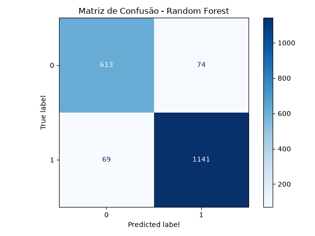

# Relatório de Resultados — Random Forest

## 1. Configuração do Modelo

O modelo empregado neste estudo foi o **Random Forest Classifier**, cujos hiperparâmetros foram determinados por meio de um processo de **Grid Search**. A tabela a seguir apresenta a configuração final selecionada:

| Hiperparâmetro     | Valor                  |
| ------------------- | ---------------------- |
| `n_estimators`      | **200**                |
| `criterion`         | **entropy**             |
| `class_weight`      | **balanced_subsample**  |
| `max_depth`         | **30**                  |
| `min_samples_leaf`  | **1**                   |
| `max_features`      | **sqrt**                 |
| `random_state`      | **42**                   |

A seleção dos hiperparâmetros foi conduzida por meio de **validação cruzada estratificada com 5 folds**, na qual foram avaliadas **216 combinações distintas** de parâmetros.

O critério adotado para a escolha do melhor modelo foi o **F1 macro**, uma vez que essa métrica atribui peso igual às duas classes, sendo, portanto, mais adequada do que a acurácia isolada em um conjunto de dados com distribuição desigual entre as classes.

---

## 2. Resultado da Validação Cruzada

O melhor conjunto de hiperparâmetros produziu os seguintes resultados médios na validação cruzada:

| Métrica          |  Resultado |
| ----------------- | ---------: |
| Accuracy           |     0,9246 |
| Precision macro    |     0,9174 |
| Recall macro       |     0,9202 |
| **F1 macro**       | **0,9187** |

A configuração ótima identificada foi:

| Hiperparâmetro     | Valor                 |
| ------------------- | --------------------- |
| `class_weight`       | `balanced_subsample`  |
| `max_depth`          | `30`                   |
| `max_features`       | `sqrt`                 |
| `min_samples_leaf`   | `1`                     |
| `n_estimators`       | `200`                   |

É importante destacar que a configuração com **200 árvores** apresentou desempenho praticamente equivalente à configuração com **300 árvores**:

| Número de Árvores | Melhor F1 Macro |
| -----------------: | ---------------: |
| 150                 |          0,916790 |
| **200**             |      **0,918670** |
| 300                 |          0,918622 |

A diferença entre as configurações de 200 e 300 árvores foi de aproximadamente **0,00005**, valor extremamente pequeno no contexto deste experimento. Conclui-se, portanto, que o aumento de 200 para 300 árvores não proporciona ganho relevante de desempenho, ainda que eleve o custo computacional do modelo.

---

## 3. Avaliação no Conjunto de Teste

Após a etapa de seleção de hiperparâmetros, o modelo final foi treinado com o conjunto de treinamento completo e avaliado sobre o conjunto de teste, composto por **1.897 amostras**, distribuídas da seguinte forma:

| Classe    |  Amostras |
| ---------- | --------: |
| Classe 0   |       687 |
| Classe 1   |     1.210 |
| **Total**  | **1.897** |

Os resultados obtidos no conjunto de teste foram:

| Classe            | Precision |   Recall | F1-score |   Support |
| ------------------ | --------: | -------: | -------: | --------: |
| **0**               |      0,90 |     0,89 |     0,90 |       687 |
| **1**               |      0,94 |     0,94 |     0,94 |     1.210 |
| **Macro avg**       |  **0,92** | **0,92** | **0,92** |     1.897 |
| **Weighted avg**    |  **0,92** | **0,92** | **0,92** |     1.897 |
| **Accuracy**        |           |          | **0,92** | **1.897** |

A acurácia final obtida foi de **0,9246**, correspondendo a aproximadamente **92,46%** de classificações corretas.

---

## 4. Matriz de Confusão

A matriz de confusão permite analisar diretamente os acertos e os erros cometidos pelo modelo em cada classe. A partir dela derivam-se os quatro valores usados nas fórmulas das métricas apresentadas nas seções seguintes:

- **VP (Verdadeiro Positivo):** amostras da classe positiva corretamente classificadas;
- **VN (Verdadeiro Negativo):** amostras da classe negativa corretamente classificadas;
- **FP (Falso Positivo):** amostras da classe negativa classificadas incorretamente como positivas;
- **FN (Falso Negativo):** amostras da classe positiva classificadas incorretamente como negativas.



**Figura 1** — Matriz de confusão do modelo Random Forest no conjunto de teste.

A matriz obtida foi:

|              | Predito: 0 | Predito: 1 |
| ------------- | ---------: | ---------: |
| **Real: 0**    |    **613** |     **74** |
| **Real: 1**    |     **69** |  **1.141** |

A interpretação dos valores é a seguinte:

- **613** amostras da classe 0 foram corretamente classificadas como classe 0;
- **74** amostras da classe 0 foram incorretamente classificadas como classe 1;
- **69** amostras da classe 1 foram incorretamente classificadas como classe 0;
- **1.141** amostras da classe 1 foram corretamente classificadas como classe 1.

O modelo classificou corretamente **1.754** amostras de um total de **1.897**, resultando em uma acurácia de **92,46%**.

O total de erros foi de **143 amostras**, correspondendo a aproximadamente **7,54%** do conjunto de teste. Um aspecto positivo observado é que a quantidade de erros entre as classes é bastante semelhante:

| Tipo de Erro          | Quantidade |
| ---------------------- | ---------: |
| Classe 0 → Classe 1     |     **74** |
| Classe 1 → Classe 0     |     **69** |

Essa proximidade indica que os erros do modelo não estão fortemente concentrados em uma única classe.

---

## 5. Precision

A *precision* indica, entre as amostras classificadas pelo modelo como pertencentes a uma determinada classe, quantas de fato pertenciam a essa classe. É calculada, para cada classe, por:

$$Precision = \frac{VP}{VP + FP}$$

Já a *precision macro*, que resume o desempenho do modelo entre as $C$ classes com peso igual para cada uma, é dada pela média aritmética simples das precisions individuais:

$$Precision_{macro} = \frac{1}{C}\sum_{i=1}^{C} Precision_i$$

Os resultados obtidos foram:

| Classe               |  Precision |
| --------------------- | ---------: |
| Classe 0               |   **0,90** |
| Classe 1               |   **0,94** |
| **Precision macro**    | **≈ 0,92** |

O modelo apresentou boa capacidade de realizar classificações positivas corretas para ambas as classes, sendo a diferença entre elas relativamente pequena, com leve vantagem para a classe 1.

---

## 6. Recall

O *recall* mede a capacidade do modelo de identificar corretamente as amostras que de fato pertencem a uma determinada classe. É calculado, para cada classe, por:

$$Recall = \frac{VP}{VP + FN}$$

Da mesma forma, o *recall macro* é a média aritmética simples dos recalls individuais das $C$ classes:

$$Recall_{macro} = \frac{1}{C}\sum_{i=1}^{C} Recall_i$$

Os resultados obtidos foram:

| Classe             |     Recall |
| ------------------- | ---------: |
| Classe 0             |   **0,89** |
| Classe 1             |   **0,94** |
| **Recall macro**     | **≈ 0,92** |

O *recall* de **0,89** para a classe 0 indica que aproximadamente 89% das amostras dessa classe foram corretamente identificadas. Para a classe 1, o valor de **0,94** indica que aproximadamente 94% de suas amostras foram corretamente identificadas. Essa diferença evidencia que a classe 0 apresenta maior dificuldade de classificação para o modelo.

---

## 7. F1-score

O **F1-score** combina *precision* e *recall* em uma única métrica, por meio da média harmônica entre os dois, sendo particularmente útil quando há interesse em equilibrar ambos os aspectos de desempenho:

$$F1 = 2 \times \frac{Precision \times Recall}{Precision + Recall}$$

O **F1 macro** é obtido calculando o F1-score de cada classe individualmente e, em seguida, tirando a média aritmética simples entre as $C$ classes:

$$F1_{macro} = \frac{1}{C}\sum_{i=1}^{C} F1_i$$

Os resultados obtidos foram:

| Classe         |   F1-score |
| --------------- | ---------: |
| Classe 0         |   **0,90** |
| Classe 1         |   **0,94** |
| **F1 macro**     | **≈ 0,92** |

Os valores de F1-score de **0,90** para a classe 0 e **0,94** para a classe 1 demonstram desempenho elevado em ambas as classes. O F1 macro é especialmente relevante neste experimento, pois calcula a média do desempenho das classes atribuindo peso igual a cada uma delas. Assim, o valor próximo de **0,92** confirma que o desempenho do modelo permanece elevado mesmo quando as duas classes recebem o mesmo peso na avaliação.

---

## 8. Accuracy

A *accuracy* (acurácia) representa a proporção de previsões corretas — considerando todas as classes conjuntamente — em relação ao total de amostras avaliadas:

$$Accuracy = \frac{VP + VN}{VP + VN + FP + FN}$$

A acurácia obtida no conjunto de teste foi:

**Accuracy = 0,9246**

Ou seja, aproximadamente **92,46%** das amostras foram classificadas corretamente. Embora se trate de uma métrica relevante, a acurácia não deve ser utilizada isoladamente neste experimento, uma vez que o conjunto de dados apresenta distribuição desigual entre as classes:

| Classe    |  Amostras | Proporção |
| ---------- | --------: | --------: |
| Classe 0   |       687 |    36,22% |
| Classe 1   |     1.210 |    63,78% |
| **Total**  | **1.897** |  **100%** |

Dessa forma, uma avaliação baseada exclusivamente na acurácia poderia ocultar diferenças de desempenho entre as classes. Por esse motivo, o F1 macro, a *precision* macro, o *recall* macro e as métricas individuais por classe são mais informativos para a análise do modelo.

---

## 9. Comparação entre Validação Cruzada e Teste

Uma característica relevante dos resultados é a proximidade entre o desempenho observado durante a validação cruzada e aquele obtido no conjunto de teste.

**Validação cruzada**

| Métrica           |  Resultado |
| ------------------- | ---------: |
| Accuracy             |     0,9246 |
| Precision macro      |     0,9174 |
| Recall macro         |     0,9202 |
| **F1 macro**         | **0,9187** |

**Conjunto de teste**

| Métrica           |  Resultado |
| ------------------- | ---------: |
| Accuracy             | **0,9246** |
| Precision macro      |     ≈ 0,92 |
| Recall macro         |     ≈ 0,92 |
| **F1 macro**         | **≈ 0,92** |

A proximidade entre os resultados não evidencia queda significativa de desempenho ao aplicar o modelo a dados não utilizados durante o treinamento. Portanto, os resultados sugerem que o Random Forest apresentou boa capacidade de **generalização** para o conjunto de teste.

---

## 10. Influência do Número de Árvores (`n_estimators`)

A análise das configurações avaliadas pelo Grid Search mostrou:

| `n_estimators` | F1 Macro Médio | Melhor F1 Macro |
| --------------: | --------------: | ---------------: |
| 150               |         0,912176 |          0,916790 |
| **200**           |     **0,912264** |      **0,918670** |
| 300               |         0,912294 |          0,918622 |

Observa-se que o aumento do número de árvores produz apenas alterações marginais no desempenho. O melhor resultado foi obtido com **200 árvores**, enquanto a configuração com 300 árvores apresentou resultado praticamente idêntico. Dessa forma, a utilização de 200 árvores representa uma escolha adequada, pois proporciona desempenho equivalente ao obtido com 300 árvores, porém com menor custo computacional.

### Relação com a Análise OOB

Esse resultado também explica por que o número ideal de árvores observado anteriormente pela análise *Out-of-Bag* (OOB) foi de aproximadamente 300, enquanto a validação cruzada selecionou 200. A estimativa OOB e a validação cruzada são procedimentos distintos e podem produzir pontos ótimos ligeiramente diferentes. Não há, portanto, contradição entre os resultados:

- **OOB:** indicou aproximadamente 300 árvores;
- **Grid Search + validação cruzada:** selecionou 200 árvores;
- **Diferença de desempenho entre 200 e 300 árvores:** praticamente desprezível.

Nesse cenário, a escolha de 200 árvores é considerada razoável, por apresentar o melhor F1 macro observado com menor custo computacional.

---

## 11. Influência do `class_weight`

O melhor modelo utilizou a configuração:

```
class_weight = 'balanced_subsample'
```

Esse resultado é relevante em razão da distribuição desigual das classes. O parâmetro `balanced_subsample` realiza o balanceamento dos pesos das classes considerando as amostras utilizadas na construção de cada árvore da floresta.

A presença dessa configuração entre os melhores resultados indica que o tratamento do desbalanceamento contribuiu para um desempenho mais equilibrado entre as classes. Isso é especialmente relevante porque o objetivo não é apenas maximizar o número total de classificações corretas, mas também manter um bom desempenho na identificação da classe minoritária.

---

## 12. Análise dos Erros

A matriz de confusão permite observar a seguinte distribuição de resultados:

| Tipo de Resultado                    | Quantidade |
| -------------------------------------- | ---------: |
| Classe 0 corretamente classificada       |    **613** |
| Classe 0 classificada como 1             |     **74** |
| Classe 1 classificada como 0             |     **69** |
| Classe 1 corretamente classificada       |  **1.141** |
| **Total de acertos**                     |  **1.754** |
| **Total de erros**                       |    **143** |

Os erros de classificação representam:

$$\frac{143}{1.897} \times 100 \approx 7,54\%$$

do conjunto de teste. Um aspecto positivo é que a quantidade de erros entre as classes é bastante semelhante:

| Classe Real | Erros  |
| ------------ | -----: |
| Classe 0      | **74** |
| Classe 1      | **69** |

Esse comportamento reforça a indicação de que o modelo não está simplesmente favorecendo a classe majoritária.

---

## 13. Principais Conclusões

Os resultados obtidos permitem concluir que o Random Forest apresentou desempenho elevado na tarefa de classificação, alcançando aproximadamente **92,46%** de acurácia no conjunto de teste e **F1 macro próximo de 0,92**.

O desempenho individual das classes também foi satisfatório: a classe 0 apresentou *precision* de 0,90, *recall* de 0,89 e F1-score de 0,90, enquanto a classe 1 apresentou *precision* de 0,94, *recall* de 0,94 e F1-score de 0,94.

A diferença entre as métricas das classes demonstra que a classe 0 é ligeiramente mais difícil de classificar. Entretanto, essa diferença não é suficientemente grande para indicar um comportamento fortemente enviesado em favor da classe majoritária.

A matriz de confusão reforça essa conclusão: foram observadas 74 classificações incorretas da classe 0 como classe 1 e 69 classificações incorretas da classe 1 como classe 0, evidenciando erros relativamente equilibrados entre as classes.

O F1 macro de aproximadamente **0,92** constitui uma das principais evidências do bom desempenho do modelo, por atribuir peso igual às duas classes. A *precision* macro e o *recall* macro, também próximos de 0,92, reforçam a indicação de equilíbrio entre a capacidade de evitar classificações incorretas e a capacidade de identificar corretamente as amostras de cada classe.

O emprego de `class_weight='balanced_subsample'` mostrou-se adequado diante do desbalanceamento existente no conjunto de dados, contribuindo para que o modelo mantivesse desempenho satisfatório em ambas as classes.

A comparação entre 150, 200 e 300 árvores mostrou que 200 árvores foram suficientes para atingir o melhor resultado, com F1 macro de 0,9187. O aumento para 300 árvores não produziu ganho relevante, apresentando F1 macro de 0,9186. Assim, a utilização de 200 árvores oferece uma relação adequada entre desempenho preditivo e custo computacional.

Por fim, a proximidade entre os resultados da validação cruzada e do conjunto de teste indica que o modelo apresenta boa capacidade de generalização, não sendo observada redução relevante de desempenho ao ser aplicado a amostras não utilizadas no treinamento.

---

## 14. Síntese dos Resultados

| Indicador                     |              Resultado |
| ------------------------------- | ----------------------: |
| **Accuracy no teste**            |              **92,46%** |
| **F1 macro — CV**                |              **91,87%** |
| F1 classe 0                      |                     90% |
| F1 classe 1                      |                     94% |
| Precision classe 0               |                     90% |
| Precision classe 1                |                     94% |
| Recall classe 0                   |                     89% |
| Recall classe 1                   |                     94% |
| Precision macro — CV              |                  91,74% |
| Recall macro — CV                 |                  92,02% |
| Número de árvores                 |                 **200** |
| Critério de divisão               |             **Entropy** |
| Balanceamento                     |  **Balanced Subsample** |
| Profundidade máxima               |                  **30** |
| Amostras no teste                 |               **1.897** |
| Classificações corretas           |               **1.754** |
| Classificações incorretas         |                 **143** |
| Taxa de acerto                    |              **92,46%** |
| Taxa de erro                      |               **7,54%** |

---

## 15. Conclusão Geral

O **Random Forest** demonstrou desempenho consistente e equilibrado na classificação das duas classes, alcançando acurácia de **92,46%** e F1 macro próximo de **0,92**. As métricas de *precision*, *recall* e F1-score por classe indicam que o modelo não depende exclusivamente da classe majoritária para obter seu desempenho, apresentando resultados satisfatórios também para a classe minoritária.

A matriz de confusão confirma esse comportamento, uma vez que os erros de classificação foram relativamente equilibrados entre as duas classes. A utilização de `balanced_subsample` mostrou-se adequada ao cenário de desbalanceamento, enquanto **200 árvores** proporcionaram o melhor compromisso entre desempenho e custo computacional.

Em conjunto, os resultados obtidos indicam que o modelo possui boa capacidade de generalização e apresenta-se como uma abordagem adequada para o problema de classificação investigado.

