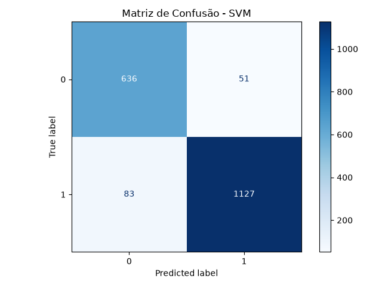
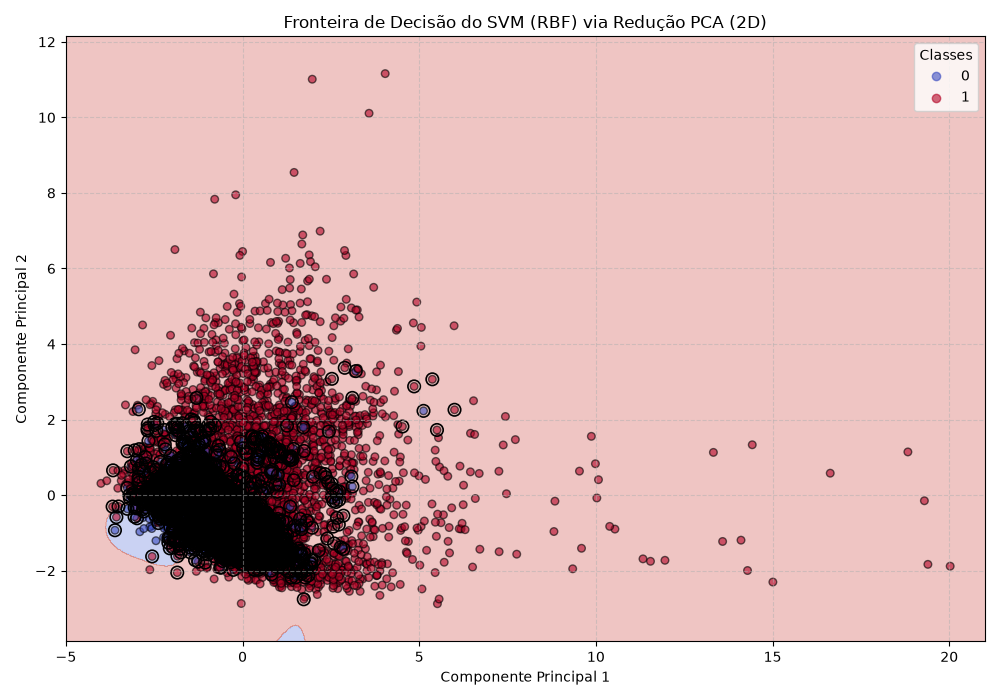

# Relatório de Resultados — Support Vector Machine (SVM)

## 1. Configuração do Modelo

O modelo empregado neste estudo foi o **Support Vector Classifier** (`SVC`, scikit-learn), cujos hiperparâmetros foram determinados por meio de um processo de **GridSearchCV** utilizando validação cruzada com 3 *folds* (366 *fits* de validação + 1 *refit* final). A tabela a seguir apresenta a configuração final selecionada:

| Hiperparâmetro | Valor |
| --- | --- |
| `kernel` | **rbf** |
| `C` | **400.0** |
| `gamma` | **0.05** |
| `class_weight` | **None** |

O parâmetro `C` atua como a constante de penalização dos erros de classificação, enquanto `gamma` define o alcance de influência de cada suporte individual no kernel RBF. A combinação `C=400.0` e `gamma=0.05` permitiu construir uma fronteira de decisão não linear capaz de modelar adequadamente a complexidade do espaço de atributos.

A tabela abaixo resume as métricas médias obtidas no processo de validação cruzada durante a busca em grade para as melhores configurações de cada tipo de kernel avaliado:

| Rank | Kernel | C | Gamma | Degree | Coef0 | F1 Macro (CV) | Std F1 Macro | Accuracy (CV) | Precision Macro (CV) | Recall Macro (CV) | Tempo Médio Fit (s) |
| ---: | :--- | ---: | ---: | ---: | ---: | ---: | ---: | ---: | ---: | ---: | ---: |
| **1** | **rbf** | **400.0** | **0.05** | **—** | **—** | **0,9084** | 0,0049 | 0,9140 | 0,9033 | 0,9154 | 0,58 |
| 35 | poly | 300.0 | scale | 3.0 | 1.0 | 0,9032 | 0,0076 | 0,9091 | 0,8980 | 0,9103 | 4,61 |
| 97 | linear | 10.0 | None | — | — | 0,8296 | 0,0044 | 0,8411 | 0,8281 | 0,8336 | 0,86 |
| 102 | sigmoid | 1.0 | 0.05 | — | 0.0 | 0,7067 | 0,0066 | 0,7290 | 0,7067 | 0,7067 | 0,43 |

---

## 2. Análise do Grid Search e Vetores de Suporte

A otimização investigou 122 combinações distintas de parâmetros divididas entre quatro tipos de kernels (`linear`: 6, `rbf`: 66, `poly`: 32, `sigmoid`: 18). O tempo total de execução foi de **51,02 segundos** em um ambiente com 12 CPUs.

A análise comparativa do comportamento dos kernels evidenciou que:

* **Kernel RBF:** Apresentou o melhor desempenho geral, com média de F1 macro de **0,9027** e valor máximo de **0,9084**. A estabilidade das predições foi alta (desvio padrão de 0,0039 entre as variações de parâmetros).
* **Kernel Polinomial:** Apresentou desempenho competitivo (máximo F1 macro de **0,9032**), porém com custo computacional substancialmente superior no refit e treino de graus elevados (tempo médio de fit atingindo **4,61 s** na melhor combinação).
* **Kernels Linear e Sigmoide:** Registraram médias mais baixas de F1 macro (**0,6839** e **0,5917**, respectivamente), demonstrando limitação na capacidade de separar o espaço de características sem projeção não linear apropriada.

No ajustamento final do modelo `RBF` sobre o conjunto de treino (5.689 amostras), foram identificados **1.251 vetores de suporte** (aproximadamente 21,99% das amostras de treino). Essa proporção indica que a fronteira de decisão foi estabelecida com uma margem bem definida sem sobrecarregar a representação da margem por hiperajuste (*overfitting*).

---

## 3. Avaliação no Conjunto de Teste

O modelo treinado foi avaliado sobre o conjunto de teste desacoplado, contendo **1.897 amostras**, distribuídas entre as classes da seguinte forma:

| Classe | Significado no Dataset | Amostras |
| :--- | :--- | ---: |
| **0** | `CONFIRMED` | 687 |
| **1** | `FALSE POSITIVE` | 1.210 |
| **Total** | | **1.897** |

Os resultados obtidos no conjunto de teste foram:

| Classe | Precision | Recall | F1-score | Support |
| :--- | ---: | ---: | ---: | ---: |
| **0** | 0,88 | 0,93 | 0,90 | 687 |
| **1** | 0,96 | 0,93 | 0,94 | 1.210 |
| **Macro avg** | **0,92** | **0,93** | **0,92** | 1.897 |
| **Weighted avg** | **0,93** | **0,93** | **0,93** | 1.897 |
| **Accuracy** | | | **0,93** | **1.897** |

A acurácia final observada no teste foi de **0,9294 (92,94%)**, superando levemente a média obtida na validação cruzada (91,40%), o que atesta forte capacidade de generalização do modelo SVM RBF em dados não vistos.

---

## 4. Matriz de Confusão

A matriz de confusão quantifica os acertos e os erros do modelo no conjunto de teste:

**Figura 1** — Matriz de confusão do modelo SVM (Kernel RBF) no conjunto de teste.

A contagem das predições resultou em:

| | Predito: 0 | Predito: 1 |
| :--- | ---: | ---: |
| **Real: 0** | **636** | **51** |
| **Real: 1** | **83** | **1.127** |

Interpretação dos quadrantes:
* **636** amostras da classe 0 (`CONFIRMED`) foram classificadas corretamente como 0 (Verdadeiros Negativos).
* **51** amostras da classe 0 foram incorretamente rotuladas como classe 1 (Falsos Positivos).
* **83** amostras da classe 1 (`FALSE POSITIVE`) foram incorretamente rotuladas como classe 0 (Falsos Negativos).
* **1.127** amostras da classe 1 foram classificadas corretamente como 1 (Verdadeiros Positivos).

O SVM obteve um total de **1.763 acertos** em **1.897 amostras**. O número total de erros foi de apenas **134 amostras (7,06%)**, mostrando uma taxa de erro bastante equilibrada em comparação com modelos puramente lineares.

---

## 5. Visualização da Fronteira de Decisão (PCA 2D)

Para inspecionar o limite de decisão gerado no espaço multidimensional de 12 variáveis, utilizou-se a redução de dimensionalidade via **Análise de Componentes Principais (PCA)** para 2 componentes:

**Figura 2** — Fronteira de decisão estimada pelo modelo SVM (RBF) projetada nas duas primeiras componentes principais (PCA 2D).

### Análise do Gráfico:
* **Espaço de Decisão:** A região em tom azul claro delimita o domínio atribuído à classe 0 (`CONFIRMED`), enquanto a extensão em tom avermelhado delimita a área associada à classe 1 (`FALSE POSITIVE`).
* **Complexidade do Limite:** O kernel RBF formou uma região contínua e suave de classificação em torno da maior concentração da classe 0, contornando a densidade dos dados sem gerar "ilhas" de sobreajuste.
* **Vetores de Suporte Destacados:** As amostras circuladas em preto marcam os vetores de suporte decisivos selecionados pelo algoritmo. Percebe-se uma alta densidade dessas amostras nas proximidades da zona de transição entre as classes, cumprindo a função teórica do SVM de maximizar a margem nas regiões de incerteza.

---

## 6. Precision, Recall e F1-Score

### Precision
A *precision* reflete a confiabilidade do modelo ao atribuir uma classe:

$$Precision = \frac{VP}{VP + FP}$$

* **Classe 0:** $636 / (636 + 83) \approx \mathbf{0,8846}$ (0,88)
* **Classe 1:** $1127 / (1127 + 51) \approx \mathbf{0,9567}$ (0,96)
* **Precision Macro:** $(0,8846 + 0,9567) / 2 = \mathbf{0,9206}$ (0,92)

### Recall
O *recall* expressa a sensibilidade do modelo em detectar os casos de cada classe:

$$Recall = \frac{VP}{VP + FN}$$

* **Classe 0:** $636 / (636 + 51) \approx \mathbf{0,9258}$ (0,93)
* **Classe 1:** $1127 / (1127 + 83) \approx \mathbf{0,9314}$ (0,93)
* **Recall Macro:** $(0,9258 + 0,9314) / 2 = \mathbf{0,9286}$ (0,93)

### F1-score
O *F1-score* é a média harmônica entre *precision* e *recall*:

$$F1 = 2 \times \frac{Precision \times Recall}{Precision + Recall}$$

* **Classe 0:** $\mathbf{0,9047}$ (0,90)
* **Classe 1:** $\mathbf{0,9439}$ (0,94)
* **F1 Macro:** $\mathbf{0,9243}$ (0,92)

Diferentemente da Regressão Logística, em que a classe 0 sofria com menor *precision* (0,76), o SVM demonstrou equilíbrio entre as classes, sustentando um F1-score de 0,90 para a classe 0 e 0,94 para a classe 1.

---

## 7. Accuracy

A acurácia global do modelo de SVM no conjunto de teste foi:

$$Accuracy = \frac{636 + 1127}{1897} = \frac{1763}{1897} \approx \mathbf{0,9294}$$

O SVM atingiu **92,94% de acurácia total** no conjunto de teste. Esse resultado posiciona o algoritmo em patamar de igualdade com os modelos baseados em árvores de decisão, como o Random Forest (que atingiu ~92,57%), superando em mais de 8 pontos percentuais a Regressão Logística (84,71%).

---

## 8. Análise dos Erros

A distribuição total das amostras do conjunto de teste resultou em:

| Categoria | Quantidade | Proporção |
| :--- | ---: | ---: |
| Classificações Corretas | **1.763** | **92,94%** |
| Erro: Classe 0 predita como 1 | 51 | 2,69% |
| Erro: Classe 1 predita como 0 | 83 | 4,38% |
| **Total de Erros** | **134** | **7,06%** |

Os erros de classificação são bastante balanceados entre as duas direções (51 Falsos Positivos vs. 83 Falsos Negativos). Essa característica valida a eficiência do kernel RBF na separação das fronteiras, evitando viés de predição em favor de uma classe.

---

## 9. Síntese dos Resultados

| Indicador | Resultado |
| :--- | ---: |
| **Acurácia (Teste)** | **92,94%** |
| **F1 Macro (Teste)** | **0,9243** |
| **F1 Macro (Validação Cruzada CV)** | **0,9084** |
| Precision / Recall Classe 0 | 0,88 / 0,93 |
| Precision / Recall Classe 1 | 0,96 / 0,93 |
| Kernel selecionado | **RBF** |
| Parâmetros selecionados | **C = 400.0, gamma = 0.05** |
| Número de Vetores de Suporte | **1.251** (de 5.689 amostras) |
| Tempo de Grid Search | **51,02 s** (367 fits) |
| Amostras no Teste | 1.897 |
| Acertos no Teste | 1.763 |
| Erros no Teste | 134 |

---

## 10. Conclusão Geral

O modelo de **Support Vector Machine (SVM)** com kernel **RBF** apresentou excelente desempenho na tarefa de classificação de exoplanetas da missão Kepler. Com acurácia de **92,94%** e F1 macro de **0,9243** no conjunto de teste, o algoritmo provou ser plenamente capaz de capturar a não linearidade intrínseca aos parâmetros astrofísicos do trânsito planetário.

Ao comparar com os outros modelos do projeto:
1. **Superou expressivamente a Regressão Logística** (84,71% de acurácia), evidenciando que uma fronteira puramente linear é insuficiente para este dataset.
2. **Equiparou-se ao Random Forest** (92,57% de acurácia), consolidando-se como uma alternativa matemática robusta, de alta confiabilidade e com métricas de *precision* e *recall* balanceadas entre ambas as classes (`CONFIRMED` e `FALSE POSITIVE`).

A utilização de escalonamento de dados aliado à busca de hiperparâmetros garantiu uma fronteira de decisão bem adjusted (com 1.251 vetores de suporte), sem sinais de sobreajuste. O SVM firma-se, portanto, como um dos melhores classificadores desenvolvidos neste trabalho.